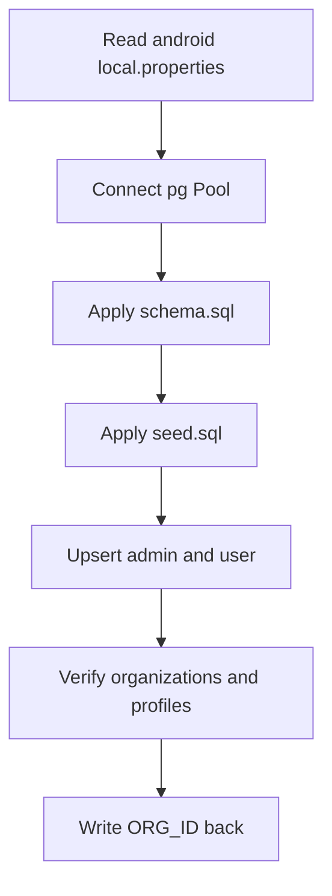

# Supabase DB Helper for RAN CRM

Overview: create a Node.js TypeScript helper located at [supabase/run-db-seed.ts](supabase/run-db-seed.ts:1) to re-apply schema and seed per [supabase/schema.sql](supabase/schema.sql:1), [supabase/seed.sql](supabase/seed.sql:1), [supabase/USERS.md](supabase/USERS.md:1), and [Instructions.md](Instructions.md:1).

Prerequisites
- Node.js 18+ and pnpm or npm
- Postgres connection string and anon key in [android/local.properties](android/local.properties:1)
- Supabase project allows SQL execution via Postgres user in [android/local.properties](android/local.properties:1)

Files to be added
- [supabase/package.json](supabase/package.json:1)
- [supabase/tsconfig.json](supabase/tsconfig.json:1)
- [supabase/run-db-seed.ts](supabase/run-db-seed.ts:1)

Security and connectivity
- Connect using pg to the URL in [android/local.properties](android/local.properties:6)
- Enforce SSL: set ssl rejectUnauthorized false for Supabase
- Do not use service_role key; the script uses Postgres auth only

CLI usage
- ts-node [supabase/run-db-seed.ts](supabase/run-db-seed.ts:1) --all
- Flags:
  - --schema-only: apply [supabase/schema.sql](supabase/schema.sql:1)
  - --seed-only: apply [supabase/seed.sql](supabase/seed.sql:1)
  - --all: apply schema then seed
  - --verify: print organizations and profiles, surface org_id
  - --upsert-users: run upserts for admin@ran.com and user@ran.com
  - --org RAN Co: set org display name used by upserts
  - --write-org-id: update ORG_ID in [android/local.properties](android/local.properties:1) after verify
  - --db postgresql://...: override SUPABASE_URL from [android/local.properties](android/local.properties:6)

Examples
- npx ts-node [supabase/run-db-seed.ts](supabase/run-db-seed.ts:1) --all --upsert-users --org RAN Co --verify --write-org-id
- npx ts-node [supabase/run-db-seed.ts](supabase/run-db-seed.ts:1) --schema-only
- npx ts-node [supabase/run-db-seed.ts](supabase/run-db-seed.ts:1) --seed-only --upsert-users

Behavior
- The helper parses [android/local.properties](android/local.properties:1) to load SUPABASE_URL, SUPABASE_ANON_KEY, ORG_ID
- It opens a Pool to the database with SSL enabled
- It reads [supabase/schema.sql](supabase/schema.sql:1) and executes as a single multi-statement query
- It reads [supabase/seed.sql](supabase/seed.sql:1) and executes as a single multi-statement query
- If --upsert-users is set, it executes:
  - select upsert_profile_by_email('admin@ran.com','Admin','admin','RAN Co');
  - select upsert_profile_by_email('user@ran.com','User','user','RAN Co');
- With --verify, it runs:
  - select * from organizations order by created_at desc;
  - select id,email,display_name,role,org_id,created_at from profiles order by created_at desc;
- With --write-org-id, it finds the org id for --org and updates ORG_ID in [android/local.properties](android/local.properties:1)

Function layout to implement
- [runDbSeed()](supabase/run-db-seed.ts:1): orchestrates CLI and operations
- [parseArgs()](supabase/run-db-seed.ts:1): returns flags and values
- [loadLocalProperties()](supabase/run-db-seed.ts:1): reads [android/local.properties](android/local.properties:1) into a map
- [getDbPool()](supabase/run-db-seed.ts:1): constructs pg Pool from SUPABASE_URL with ssl
- [readSqlFile(path: string)](supabase/run-db-seed.ts:1): loads file text
- [applySql(sql: string, pool)](supabase/run-db-seed.ts:1): executes multi-statement SQL
- [upsertDefaultUsers(orgName: string)](supabase/run-db-seed.ts:1): executes upsert_profile_by_email calls
- [verifyAndSummarize(orgName?: string)](supabase/run-db-seed.ts:1): prints organizations, profiles, and org id
- [writeBackOrgId(orgId: string)](supabase/run-db-seed.ts:1): rewrites [android/local.properties](android/local.properties:1)
- [safeExit(code: number)](supabase/run-db-seed.ts:1): closes Pool and exits

Error handling
- Detect foreign key violations noted in [supabase/USERS.md](supabase/USERS.md:71) and surface guidance
- If upserts fail due to missing Auth users, print reminder to create users via Dashboard
- If schema apply fails, show first error with line number hint when possible
- Always close Pool on error

Idempotency rules
- Schema and seed use create or replace and IF NOT EXISTS, making repeated runs safe
- Upsert calls are safe; profiles rows will be updated

Org id write-back details
- When --verify and --write-org-id, search for the org by name
- If found, update ORG_ID in [android/local.properties](android/local.properties:1)
- If not found, keep existing ORG_ID and emit a warning

Logging
- Print clear sections: SCHEMA, SEED, UPSERT USERS, VERIFY, WRITE ORG_ID
- Show total statements executed and elapsed time

RLS and policies awareness
- After seed, policies in [supabase/schema.sql](supabase/schema.sql:112) will gate access
- Non-admin users cannot select profiles per [supabase/schema.sql](supabase/schema.sql:165)

Testing checklist
- Run --schema-only then --seed-only
- Create Auth users admin@ran.com and user@ran.com in Dashboard
- Run --upsert-users --verify; confirm profiles and org id appear
- Run --write-org-id to update [android/local.properties](android/local.properties:1)
- Build Android app to pick up ORG_ID as noted in [supabase/USERS.md](supabase/USERS.md:60)

Maintenance
- Re-run with --all after changing [supabase/schema.sql](supabase/schema.sql:1) or [supabase/seed.sql](supabase/seed.sql:1)
- Add new flags in [runDbSeed()](supabase/run-db-seed.ts:1) as needed

Mermaid overview

Notes
- This helper does not create Auth users; follow [supabase/USERS.md](supabase/USERS.md:14)
- For multi org deployments see [supabase/USERS.md](supabase/USERS.md:98)
- Do not embed service_role in mobile app per [supabase/USERS.md](supabase/USERS.md:104)